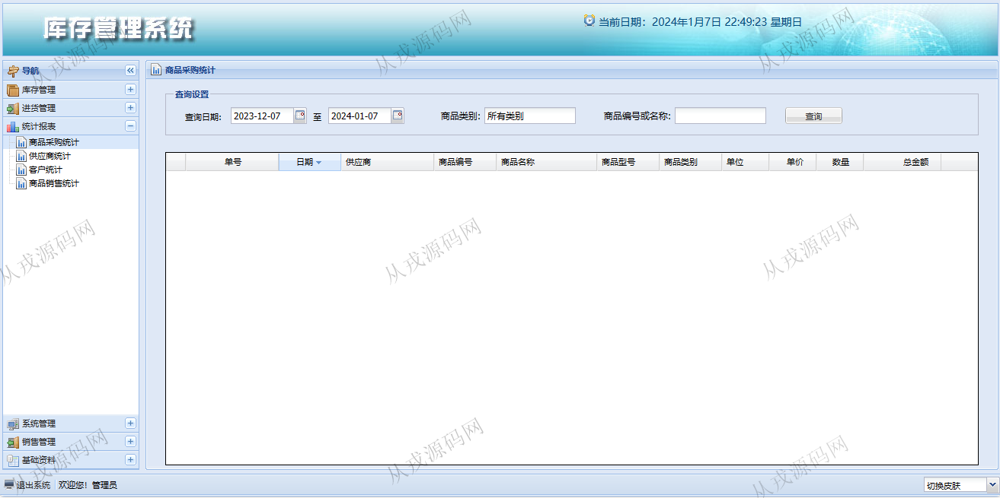

<h1 align="center">123.库存管理系统</h1>

 获取sql文件 QQ: 386869957 QQ群: 377586148 

 [推荐站点: 从戎源码网](https://armycodes.com/) 

## 简介

> 本代码来源于网络,仅供学习参考使用!
>
> 提供1.远程部署/2.修改代码/3.设计文档指导/4.框架代码讲解等服务
> 
> 访问地址：http://localhost:8080/login.jsp
> 
> 用户名密码：admin 123456
>

## 项目介绍
基于ssh的库存管理系统：前端 jsp、js，后端 struts、spring、hibernate，角色分为管理员、进货员、销售员；集成库存管理、进货管理、统计报表、销售管理等功能于一体的系统。

## 功能介绍

- 库存管理：商品报溢的增删改查，报损报溢查询，商品报损，当前库存查询，库存报警
- 进货管理：退货出库，当前库存查询，进货单据查询，进货入库的增删改查，退货单查询
- 统计报表：商品采购统计，供应商统计，客户统计，商品销售统计
- 系统管理：用户信息的增删改查，角色信息的增删改查
- 销售管理：客户退货查询，销售出库，当前库存查询，销售单据查询，客户退货
- 基础资料：客户信息的增删改查，期初库存，商品信息的增删改查（商品分类树形目录）

## 环境

- <b>IntelliJ IDEA 2021.3</b>

- <b>Mysql 5.7.26</b>

- <b>Tomcat 7.0.73</b>

- <b>JDK 1.8</b>

## 运行截图

